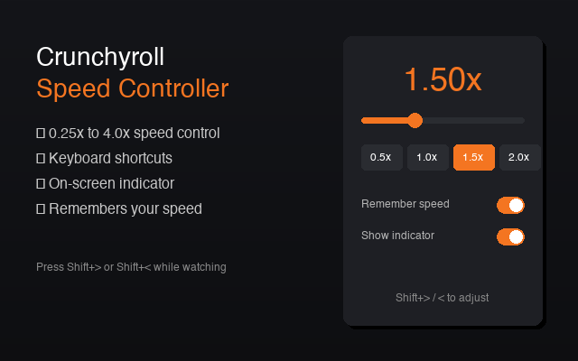

<p align="center">
  
</p>

<h1 align="center">Crunchyroll Speed Controller</h1>

<p align="center">
  <strong>Watch anime at your own pace</strong>
</p>

<p align="center">
  <a href="#installation">Install</a> •
  <a href="#features">Features</a> •
  <a href="#usage">Usage</a> •
  <a href="#keyboard-shortcuts">Shortcuts</a> •
  <a href="#contributing">Contributing</a>
</p>

<p align="center">
  
  
  
  
</p>

<p align="center">
  
</p>

---

## Features

| Feature | Description |
|---------|-------------|
| **Speed Control** | Adjust playback from 0.25x to 4.0x |
| **Quick Buttons** | One-click presets: 0.5x, 0.75x, 1.0x, 1.25x, 1.5x, 2.0x |
| **Keyboard Shortcuts** | Control speed without leaving fullscreen |
| **On-Screen Indicator** | See current speed with auto-hiding overlay |
| **Remember Speed** | Persists your preferred speed across sessions |
| **Dark Theme** | Seamlessly matches Crunchyroll's aesthetic |

---

## Installation

### Option 1: Chrome Web Store
> **Status:** Pending Review

Once approved, install directly from the Chrome Web Store (link coming soon).

### Option 2: Manual Install (Developer Mode)

<details>
<summary><strong>Click to expand installation steps</strong></summary>

#### Step 1: Download
```bash
git clone https://github.com/flyy4abrownguy/crunchyroll-speed-controller.git
```
Or [download ZIP](https://github.com/flyy4abrownguy/crunchyroll-speed-controller/archive/refs/heads/main.zip) and extract.

#### Step 2: Open Chrome Extensions
Navigate to `chrome://extensions` in your browser.

#### Step 3: Enable Developer Mode
Toggle **"Developer mode"** in the top-right corner.

#### Step 4: Load Extension
1. Click **"Load unpacked"**
2. Select the `crunchyroll-speed-controller` folder (containing `manifest.json`)

#### Step 5: Done!
The extension icon appears in your toolbar. Navigate to [Crunchyroll](https://crunchyroll.com) and enjoy!

</details>

---

## Usage

### Popup Controls

Click the extension icon while on Crunchyroll to open the control panel:

- **Slider** — Drag to set any speed from 0.25x to 4.0x
- **Quick Buttons** — Instant presets (0.5x, 0.75x, 1.0x, 1.25x, 1.5x, 2.0x)
- **Slower / Faster** — Fine-tune by 0.25x increments
- **Reset** — Return to normal speed (1.0x)

### Settings

| Setting | Description |
|---------|-------------|
| **Remember speed** | Save your preferred speed across sessions |
| **Show indicator** | Toggle the on-screen speed display |

---

## Keyboard Shortcuts

Use these shortcuts while watching on Crunchyroll:

| Action | Shortcut |
|--------|----------|
| Increase speed | `Shift` + `>` |
| Decrease speed | `Shift` + `<` |
| Reset to 1.0x | `Shift` + `?` |

### Global Shortcuts (Customizable)

These work even when the page isn't focused. Customize them at `chrome://extensions/shortcuts`:

| Action | Default |
|--------|---------|
| Increase speed | `Alt` + `.` |
| Decrease speed | `Alt` + `,` |
| Reset to 1.0x | `Alt` + `0` |
| Toggle indicator | `Alt` + `V` |

---

## Project Structure

```
crunchyroll-speed-controller/
├── manifest.json        # Extension configuration (Manifest V3)
├── background/
│   └── service-worker.js    # Handles keyboard commands
├── content/
│   ├── content.js       # Video control & speed indicator
│   └── content.css      # Indicator overlay styles
├── popup/
│   ├── popup.html       # Popup UI structure
│   ├── popup.css        # Dark theme styling
│   └── popup.js         # Popup logic & settings
├── icons/               # Extension icons (16, 32, 48, 128px)
├── store-assets/        # Chrome Web Store graphics
└── privacy-policy.md    # Privacy policy
```

---

## Privacy

This extension respects your privacy:

- **No data collection** — We don't collect any personal information
- **No tracking** — No analytics, no external requests
- **Local storage only** — Settings saved locally via Chrome's storage API
- **Open source** — Full code transparency

See [privacy-policy.md](privacy-policy.md) for details.

---

## Contributing

Contributions are welcome! Feel free to:

1. Fork the repository
2. Create a feature branch (`git checkout -b feature/amazing-feature`)
3. Commit your changes (`git commit -m 'Add amazing feature'`)
4. Push to the branch (`git push origin feature/amazing-feature`)
5. Open a Pull Request

### Ideas for Contributions
- [ ] Add more playback speed presets
- [ ] Custom keyboard shortcut configuration in popup
- [ ] Sync settings across devices
- [ ] Support for other streaming sites

---

## License

MIT License — see [LICENSE](LICENSE) for details.

---

<p align="center">
  Made with ☕ for anime fans who like to watch at their own pace.
</p>

<p align="center">
  <a href="https://github.com/flyy4abrownguy/crunchyroll-speed-controller/issues">Report Bug</a> •
  <a href="https://github.com/flyy4abrownguy/crunchyroll-speed-controller/issues">Request Feature</a>
</p>
